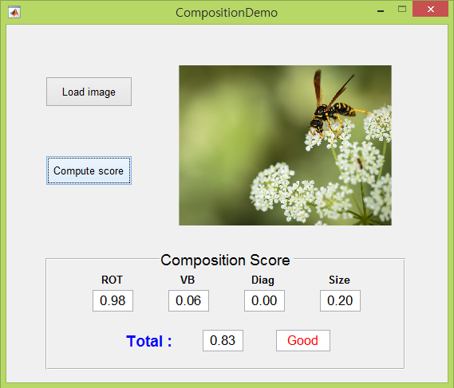

# Composition Score Calculator #

## Introduction ##
This easy to use matlab project calculates an image's composition score to measure its aesthetic quality using Deep Learning. Included is a GUI that takes an image and displays its score in a user friendly way.

## Files ##
* [getCompScore_demo.m](Composition%20Score%20Calculator/getCompScore_demo.m) : Main function
   * Extract prominent line and salient object information of an input image then using these information, calculate total composition score  
   * Total composition score is weighted sum of four composition guideline score (Rule of Third, Visual Balance, Diagonal Dominance, Object Size)  

* [getLine.m](Composition%20Score%20Calculator/getLine.m) : Extract prominent line from an input image

* [getLineValue.m](Composition%20Score%20Calculator/getLineValue.m) : Measure the composition score that is related to line information

* [CompositionDemo.m](Composition%20Score%20Calculator/CompositionDemo.m) : Demo function (GUI Environment)  
   * This function runs a GUI environment for calculating the composition score
   
   
## Requirements ##
* Matlab

## Coupe Project Links ##
* [Coupe Website](http://coupe.postech.ac.kr/)
* [POSTECH CG Lab.](http://cg.postech.ac.kr/)

